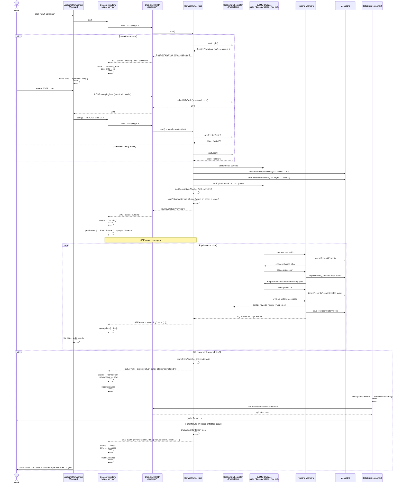
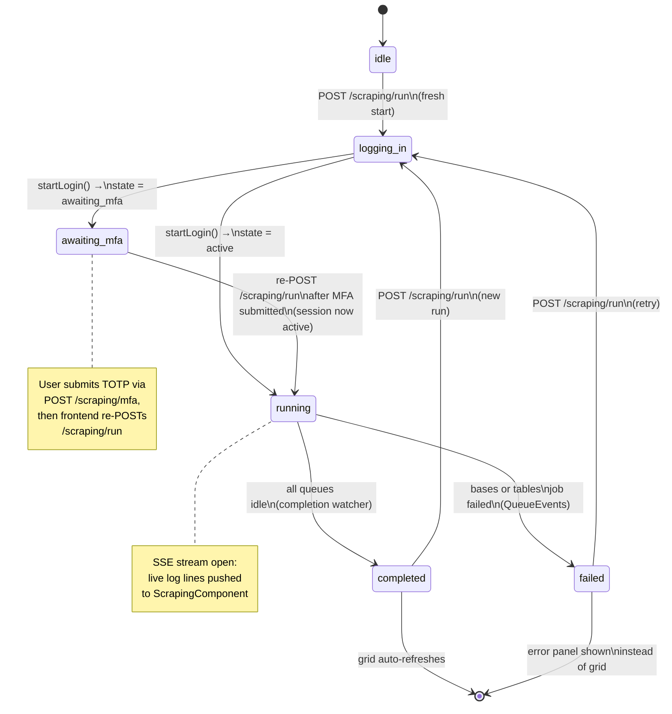

# Scraping Dashboard — Sequence & Data Flow Diagrams

---

## 1. Run Lifecycle — Sequence Diagram

Shows every actor interaction from the moment the user clicks **Start Scraping** through to the grid refresh, including the MFA branch.

---

## 2. System Data Flow Diagram

Shows the steady-state data paths: how a manual trigger moves through every layer, and how results surface back to the user.

```mermaid
flowchart TD
    subgraph Browser["Browser (Angular)"]
        BTN["Start Scraping button"]
        SStore["ScrapeRunStore\n(signals: status, logs, completedAt)"]
        SCOMP["ScrapingComponent\n(status chip + log panel)"]
        DCOMP["DataGridComponent\n(AG Grid + chart)"]
        DASH["DashboardComponent\n(grid layout)"]
        INTS["IntegrationsComponent\n(OAuth connect/disconnect)"]
        ES["EventSource\n/scraping/run/stream"]
    end

    subgraph Backend["Backend (Express / Node.js)"]
        HTTP["HTTP Server\n:3000"]
        SRS["ScrapeRunService\n(run state + SSE registry)"]
        LOG["Logger\n(addLogListener / broadcast)"]
        SO["SessionOrchestrator\n(Puppeteer)"]
    end

    subgraph Queue["BullMQ (Redis)"]
        CQ["cron queue"]
        BQ["bases queue"]
        TQ["tables queue"]
        RQ["revision-history queue"]
    end

    subgraph Workers["BullMQ Workers (in-process)"]
        CW["cron-processor\n(bootstrap)"]
        BW["bases-processor\n(ingest tables)"]
        TW["tables-processor\n(ingest records)"]
        RW["revision-history-processor\n(scrape + parse)"]
    end

    subgraph Mongo["MongoDB"]
        BASES["bases collection"]
        TABLES["tables collection"]
        PAGES["pages collection"]
        REVH["revisionHistory collection"]
        SESS["scrapeSessions collection"]
        TOKENS["tokens collection"]
    end

    subgraph Airtable["Airtable"]
        OAPI["OAuth / REST API"]
        WEB["Web UI (Puppeteer target)"]
    end

    %% ── Trigger ──────────────────────────────────────────────────────────────
    BTN -->|"store.start()"| SStore
    SStore -->|"POST /scraping/run"| HTTP
    HTTP --> SRS

    %% ── Login / MFA ──────────────────────────────────────────────────────────
    SRS -->|"startLogin()"| SO
    SO -->|"headless login"| WEB
    SO -->|"session cookies"| SESS
    SCOMP -->|"POST /scraping/mfa"| HTTP
    HTTP -->|"submitMfaCode()"| SO

    %% ── Queue bootstrap ──────────────────────────────────────────────────────
    SRS -->|"obliterate + reset"| Queue
    SRS -->|"resetAllForReprocessing()"| BASES
    SRS -->|"resetAllRevisionStatus()"| PAGES
    SRS -->|"add pipeline-tick"| CQ

    %% ── Worker pipeline ──────────────────────────────────────────────────────
    CQ --> CW
    CW -->|"ingestBases()"| OAPI
    CW -->|"upsert"| BASES
    CW -->|"enqueue base jobs"| BQ

    BQ --> BW
    BW -->|"ingestTables()"| OAPI
    BW -->|"upsert"| TABLES
    BW -->|"enqueue table + rev-hist jobs"| TQ
    BW -->|"enqueue rev-hist jobs"| RQ

    TQ --> TW
    TW -->|"getRecords()"| OAPI
    TW -->|"upsert"| PAGES

    RQ --> RW
    RW -->|"scrape cookies"| SESS
    RW -->|"fetch revision HTML"| WEB
    RW -->|"save"| REVH

    %% ── Log tee → SSE ────────────────────────────────────────────────────────
    Workers -->|"log()"| LOG
    LOG -->|"LogListener callback"| SRS
    SRS -->|"SSE event: log"| ES
    ES -->|"append line"| SStore
    SStore -->|"logs signal"| SCOMP

    %% ── Completion → grid refresh ────────────────────────────────────────────
    SRS -->|"poll getJobCounts()"| Queue
    SRS -->|"SSE event: status=completed"| ES
    ES -->|"completedAt signal"| SStore
    SStore -->|"effect(completedAt)"| DCOMP
    DCOMP -->|"GET /entities/:name/data"| HTTP
    HTTP -->|"query"| Mongo
    Mongo -->|"paginated rows"| DCOMP

    %% ── OAuth (integrations) ─────────────────────────────────────────────────
    INTS -->|"redirect to OAuth start"| OAPI
    OAPI -->|"callback + tokens"| TOKENS

    %% ── Dashboard composition ────────────────────────────────────────────────
    DASH --- INTS
    DASH --- SCOMP
    DASH --- DCOMP

    %% ── Styles ───────────────────────────────────────────────────────────────
    classDef store  fill:#dbeafe,stroke:#3b82f6,color:#1e3a8a
    classDef worker fill:#dcfce7,stroke:#22c55e,color:#14532d
    classDef queue  fill:#fef9c3,stroke:#eab308,color:#713f12
    classDef db     fill:#f3e8ff,stroke:#a855f7,color:#3b0764
    classDef ext    fill:#fee2e2,stroke:#ef4444,color:#7f1d1d
    classDef svc    fill:#ffedd5,stroke:#f97316,color:#7c2d12

    class SStore,ES store
    class CW,BW,TW,RW worker
    class CQ,BQ,TQ,RQ queue
    class BASES,TABLES,PAGES,REVH,SESS,TOKENS db
    class OAPI,WEB ext
    class SRS,SO,LOG svc
```

---

## 3. Run State Machine

